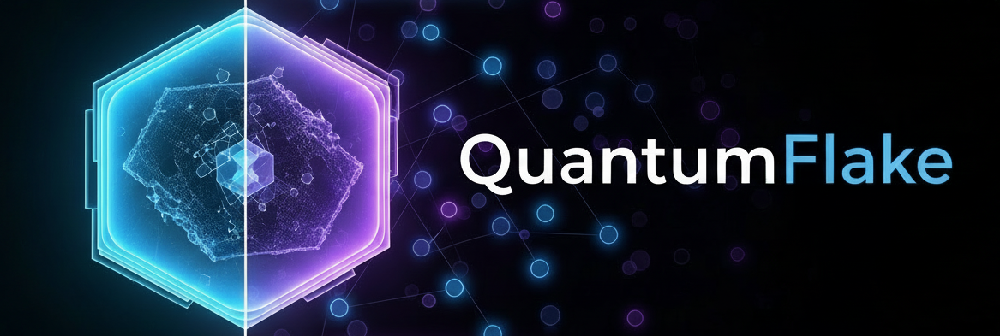

<div align="center">
  
  <div>&nbsp;</div>

[](LICENSE)

[](https://github.com/uark-cviu/quantumflake/issues)

[Installation](docs/get_started.md) |
[Model Zoo](docs/model_zoo.md) |
[Reporting Issues](https://github.com/uark-cviu/quantumflake/issues/new/choose)

</div>

<div align="center">

</div>

## Introduction

**QuantumFlake** is a modular framework for automated **detection** and **layer classification** of 2D-material flakes in microscope images. It provides a one-command pipeline covering the end-to-end workflow:

<h3 align="center">detect → crop → classify → visualize</h3>

The main branch works with **PyTorch 2.5+** and **Python 3.12+**.

<details open>
<summary>Major features</summary>

- **Multi-backend detection** — Plug-and-play support for YOLO, DETR, ViTDet, OpenVINO-YOLO (CPU), and MaskTerial (Mask2Former).
- **Detailed Reports** — Unified JSON sidecars and visualization overlays across detectors.
- **Layer Classification** — Lightweight ResNet-based layer classifier (e.g., _1-layer_, _5plus-layer_).
- **Extras** — Optional color calibration, patch-based inference for large images, progress bars, and reproducible configs.
</details>

### Related Research Showcase
Extras from our lab you can explore independently of the core framework.

- [**φ-Adapt**](./phi_adapt) — physics-informed domain adaptation.
- [**CLIFF**](./cliff) — continual learning for incremental flake features.

## Installation

Please refer to **[Installation](docs/get_started.md)** for setup instructions (CUDA/CPU options, pinned deps).

## Overview of Model Zoo

<div align="center">
  <b>Architectures</b>
</div>
<table align="center">
  <tbody>
    <tr align="center" valign="bottom">
      <td><b>Object Detection</b></td>
      <td><b>Classification</b></td>
      <td><b>Utilities</b></td>
    </tr>
    <tr valign="top">
      <td>
        <ul>
          <li><a href="docs/models/yolo.md">YOLO (Ultralytics)</a></li>
          <li><a href="docs/models/detr.md">DETR (HF)</a></li>
          <li><a href="docs/models/vitdet.md">ViTDet (Detectron2)</a></li>
          <li><a href="docs/models/openvino_yolo.md">OpenVINO-YOLO (CPU)</a></li>
          <li><a href="docs/models/maskterial.md">MaskTerial (Mask2Former)</a></li>
        </ul>
      </td>
      <td>
        <ul>
          <li><a href="docs/models/classifier.md">ResNet Layer Classifier</a></li>
        </ul>
      </td>
      <td>
        <ul>
          <li><a href="docs/guide/calibration.md">Color Calibration</a></li>
          <li><a href="docs/guide/patching.md">Patch-based Inference</a></li>
          <li><a href="docs/guide/config.md">Configuration System</a></li>
        </ul>
      </td>
    </tr>
  </tbody>
</table>

## Weights

Organize weights in a `weights/` folder:

- `weights/uark_detector_v3.pt` — YOLO detector
- `weights/flake_monolayer_classifier.pth` — classifier
- `weights/maskterial/{config.yaml, maskterial.pth}` — MaskTerial (optional)

## Pipeline

1. Detect flakes with the selected backend
2. Crop detections to flake chips
3. Classify crops (e.g., 1-layer, 5+ layers)
4. Save visualizations and JSON sidecars

Example JSON record:

```
{
  "bbox": [x1, y1, x2, y2],
  "det_conf": 0.8731,
  "cls": "1-layer",
  "cls_conf": 0.9123
}
```

Overlays are saved as `vis_<image>.png`, and per-image detections as `<image_stem>.json` inside `output_dir`.

## Configuration

See [docs/guide/config.md](docs/guide/config.md) for instructions with adjusting the configurations.

## Training (Overview)

### Detector (YOLO)

Dataset YAML:

```yaml
train: /path/to/detector_dataset/images/train
val: /path/to/detector_dataset/images/val
nc: 1
names: ["flake"]
```

Train:

```bash
python -m quantumflake.cli train detector   --data /path/to/dataset.yaml   --epochs 100   --imgsz 640   --device 0
```

> **DETR and YOLO** training details & tips live in their respective docs:
>
> - YOLO — `docs/models/yolo.md`
> - DETR — `docs/models/detr.md`

### Classifier (ImageFolder)

Folder structure:

```
my_dataset/
├── 1-layer/
│   ├── flake_01.png
│   └── ...
└── 5plus-layer/
    └── ...
```

Train:

```bash
python -m quantumflake.cli train classifier   --data my_dataset   --epochs 25   --device cuda:0   --save-dir runs/classify   --num-materials 2   --material-dim 64
```

## Project Structure

```
quantumflake/
│
├─ quantumflake/
│  ├─ __init__.py
│  ├─ cli.py
│  ├─ pipeline.py
│  ├─ cfg/
│  │   └─ default.yaml
│  ├─ models/
│  │   └─ detector.py
│  ├─ trainers/
│  │   ├─ detect.py
│  │   └─ classify.py
│  └─ utils/
│      ├─ io.py
│      ├─ data.py
│      ├─ vis.py
│      ├─ vitdet_bootstrap.py
│      ├─ maskterial_bootstrap.py
│      └─ m2f_bootstrap.py
│
├─ weights/
│   ├─ uark_detector_v3.pt
│   ├─ flake_monolayer_classifier.pth
│   └─ maskterial/
│       ├─ config.yaml
│       └─ maskterial.pth
└─ README.md
```

## Contributors

<table>
  <thead>
    <tr>
      <th>Name</th>
      <th>Affiliation</th>
    </tr>
  </thead>
  <tbody>
    <tr><td>Xuan-Bac Nguyen</td><td>University of Arkansas</td></tr>
    <tr><td>Sankalp Pandey</td><td>University of Arkansas</td></tr>
    <tr><td>Tim Faltermeier</td><td>Montana State University</td></tr>
    <tr><td>Dr. Hugh Churchill</td><td>University of Arkansas</td></tr>
    <tr><td>Dr. Nicholas Borys</td><td>Montana State University</td></tr>
    <tr><td>Dr. Khoa Luu</td><td>University of Arkansas</td></tr>
  </tbody>
</table>

## License

This project is released under the [MIT License](LICENSE).

## Citations

```
@article{pandey2025cliff,
  title={CLIFF: Continual Learning for Incremental Flake Features in 2D Material Identification},
  author={Pandey, Sankalp and Nguyen, Xuan Bac and Borys, Nicholas and Churchill, Hugh and Luu, Khoa},
  journal={arXiv preprint arXiv:2508.17261},
  year={2025}
}

@article{nguyen2025varphi,
  title={$$\backslash$varphi $-Adapt: A Physics-Informed Adaptation Learning Approach to 2D Quantum Material Discovery},
  author={Nguyen, Hoang-Quan and Nguyen, Xuan Bac and Pandey, Sankalp and Faltermeier, Tim and Borys, Nicholas and Churchill, Hugh and Luu, Khoa},
  journal={arXiv preprint arXiv:2507.05184},
  year={2025}
}
```
