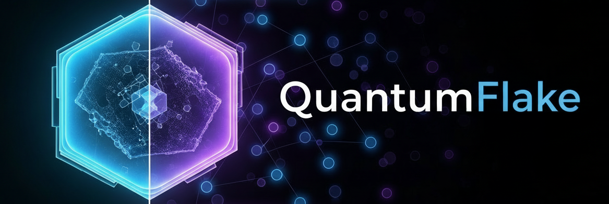

<div align="center">
  
  <div>&nbsp;</div>


[](https://github.com/uark-cviu/quantumflake/issues)

[Getting Started](docs/get_started.md) |
[Model Zoo](docs/model_zoo.md) |
[Reporting Issues](https://github.com/uark-cviu/quantumflake/issues/new/choose)

</div>

## Introduction

**QuantumFlake** is a framework for automated **flake detection** and **layer classification** in microscope images of 2D materials.

<h3 align="center">detect → crop → classify → visualize</h3>

The default pipeline uses:

- one detector checkpoint
- one classifier checkpoint

Download the checkpoints you need from our Hugging Face collection and either place them in a local folder named `weights/` or pass absolute paths with `--opts`.

<details open>
<summary>Major features</summary>

- **Multi-backend detection** — YOLO, DETR, ViTDet, OpenVINO-YOLO, and MaskTerial backends.
- **Unified outputs** — JSON sidecars plus visualization overlays.
- **Layer classification** — ResNet-based chip classifier (for example, `1-layer` and `5plus-layer`).
- **Utilities** — Optional color calibration and patch-based inference for large images.
</details>

### Research Showcase

Related research code that lives in this repo but is not required for the default quick-start:

- [**QuPAINT**](./qupaint) - multimodal reasoning with physics-aware instruction tuning
- [**φ-Adapt**](./phi_adapt) - physics-informed domain adaptation research code
- [**CLIFF**](./cliff) - continual learning for incremental flake features

## Installation

See [Getting Started](docs/get_started.md) for the full setup. The recommended core install is:

```bash
conda create -n quantumflake python=3.11 -y
conda activate quantumflake

# Install the PyTorch build that matches your platform:
# https://pytorch.org/get-started/locally/
pip install torch torchvision torchaudio

pip install -e .
```

Notes:

- `requirements.txt` is a Linux conda export from a research environment. It is not the recommended installation path.
- ViTDet and MaskTerial need Detectron2.
- MaskTerial also needs `MultiScaleDeformableAttention`.
- OpenVINO-YOLO needs `openvino`.

## Weights

Download checkpoints from the [2D Quantum Material Characterization collection](https://huggingface.co/collections/uark-cviu/2d-quantum-material-characterization).

For the standard YOLO + classifier pipeline, you need:

- `uark_detector_v3.pt`
- `flake_monolayer_classifier.pth`

Optional files:

- `maskterial/{config.yaml, maskterial.pth}` for the MaskTerial backend
- an OpenVINO IR (`.xml` + `.bin`) for the OpenVINO backend
- a calibration reference image only if you enable color calibration

The in-tree `phi_adapt` code is experimental and not part of the standard quick-start. For it, you will need `spectrum_inv.pth`.

Example local layout if you want to keep weights under the repo root:

```text
weights/
├── uark_detector_v3.pt
└── flake_monolayer_classifier.pth
```

## Quick Start

Run prediction on a single image, a directory, or a glob:

```bash
python -m quantumflake.cli predict "/path/to/images_or_glob" \
  --opts models.detector.type=yolo \
         models.detector.yolo.weights=weights/uark_detector_v3.pt \
         models.classifier.weights=weights/flake_monolayer_classifier.pth \
         device=cpu \
         output_dir=runs/predict
```

Notes:

- `device=cpu` is the safest default for docs. Switch to `cuda:0` when your environment is configured for GPU inference.
- `save_vis=true` is enabled by default in the bundled config.

Outputs:

- `vis_<image_name>` overlay images in `output_dir`
- `<image_stem>.json` sidecars in `output_dir`

Example JSON record:

```json
{
  "bbox": [x1, y1, x2, y2],
  "det_conf": 0.8731,
  "cls": "1-layer",
  "cls_conf": 0.9123
}
```

## Model Zoo

Backend-specific usage and weight expectations live in:

- [YOLO (Ultralytics)](docs/models/yolo.md)
- [DETR (HF Transformers)](docs/models/detr.md)
- [ViTDet (Detectron2)](docs/models/vitdet.md)
- [OpenVINO-YOLO (CPU)](docs/models/openvino_yolo.md)
- [MaskTerial (Mask2Former)](docs/models/maskterial.md)
- [ResNet Layer Classifier](docs/models/classifier.md)

## Configuration

See [docs/guide/config.md](docs/guide/config.md) for CLI overrides and the config schema.

## Training

### Detector (YOLO)

Dataset YAML:

```yaml
train: /path/to/detector_dataset/images/train
val: /path/to/detector_dataset/images/val
nc: 1
names: ["flake"]
```

Train:

```bash
python -m quantumflake.cli train detector \
  --type yolo \
  --data /path/to/dataset.yaml \
  --epochs 100 \
  --imgsz 640 \
  --device 0
```

### Classifier (ImageFolder)

Folder structure:

```text
my_dataset/
├── 1-layer/
│   ├── flake_01.png
│   └── ...
└── 5plus-layer/
    └── ...
```

Train:

```bash
python -m quantumflake.cli train classifier \
  --data my_dataset \
  --epochs 25 \
  --device cuda:0 \
  --save-dir runs/classify \
  --num-materials 2 \
  --material-dim 64
```

## Project Structure

```text
quantumflake/
├── quantumflake/
├── docs/
├── material_data/
├── phi_adapt/
├── qupaint/
├── cliff/
├── resources/
├── calibration_ref.jpg
├── pyproject.toml
└── README.md
```

## Contributors

<table>
  <thead>
    <tr>
      <th>Name</th>
      <th>Affiliation</th>
    </tr>
  </thead>
  <tbody>
    <tr><td>Xuan-Bac Nguyen</td><td>University of Arkansas</td></tr>
    <tr><td>Sankalp Pandey</td><td>University of Arkansas</td></tr>
    <tr><td>Tim Faltermeier</td><td>Montana State University</td></tr>
    <tr><td>Dr. Hugh Churchill</td><td>University of Arkansas</td></tr>
    <tr><td>Dr. Nicholas Borys</td><td>Montana State University</td></tr>
    <tr><td>Dr. Khoa Luu</td><td>University of Arkansas</td></tr>
  </tbody>
</table>

## Citations

```bibtex
@misc{nguyen2026qupaintphysicsawareinstructiontuning,
  title={QuPAINT: Physics-Aware Instruction Tuning Approach to Quantum Material Discovery},
  author={Xuan-Bac Nguyen and Hoang-Quan Nguyen and Sankalp Pandey and Tim Faltermeier and Nicholas Borys and Hugh Churchill and Khoa Luu},
  year={2026},
  eprint={2602.17478},
  archivePrefix={arXiv},
  primaryClass={cs.CV},
  url={https://arxiv.org/abs/2602.17478},
}

@article{pandey2025cliff,
  title={CLIFF: Continual Learning for Incremental Flake Features in 2D Material Identification},
  author={Pandey, Sankalp and Nguyen, Xuan Bac and Borys, Nicholas and Churchill, Hugh and Luu, Khoa},
  journal={arXiv preprint arXiv:2508.17261},
  year={2025}
}

@article{nguyen2025varphi,
  title={$$\backslash$varphi $-Adapt: A Physics-Informed Adaptation Learning Approach to 2D Quantum Material Discovery},
  author={Nguyen, Hoang-Quan and Nguyen, Xuan Bac and Pandey, Sankalp and Faltermeier, Tim and Borys, Nicholas and Churchill, Hugh and Luu, Khoa},
  journal={arXiv preprint arXiv:2507.05184},
  year={2025}
}

@ARTICLE{10684707,
  author={Nguyen, Xuan Bac and Bisht, Apoorva and Thompson, Benjamin and Churchill, Hugh and Luu, Khoa and Khan, Samee U.},
  journal={IEEE Access},
  title={Two-Dimensional Quantum Material Identification via Self-Attention and Soft-Labeling in Deep Learning},
  year={2024},
  volume={12},
  number={},
  pages={139683-139691},
  keywords={Microscopy;Optical imaging;Optical microscopy;Substrates;Quantum materials;Image color analysis;Annotations;Deep learning;Computer vision;Quantum material;2D flake detection;deep learning;computer vision;identification},
  doi={10.1109/ACCESS.2024.3465221}}
```
